# FireNigth

 

---

### GitHub stats

Public activity · refreshed weekly

---

### Featured project

**[Repo Security Review](https://github.com/FireNigth/Security-review)**  
A read-only security review skill for AI coding agents. It traces findings to code evidence and gives practical remediation guidance.

[Explore the project →](https://github.com/FireNigth/Security-review)

---

Clear evidence. Useful findings. Practical fixes.

